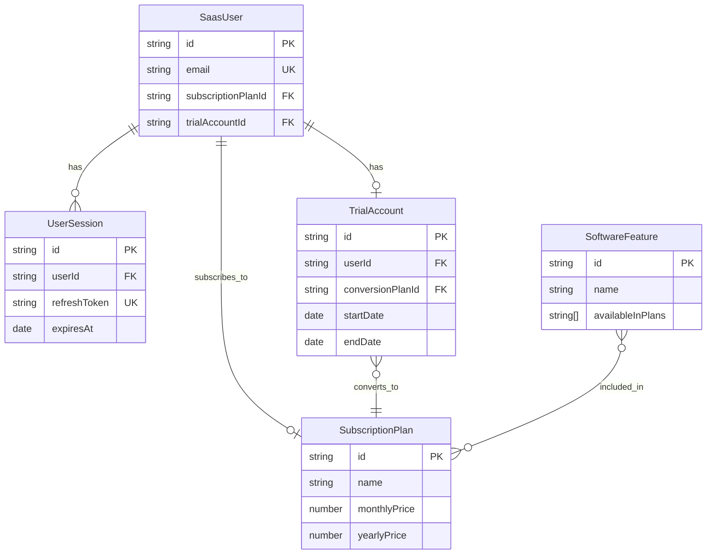

# Data Model: BakeWind SaaS Landing & Dashboard Separation

**Feature**: BakeWind SaaS Landing & Dashboard Separation
**Date**: 2025-09-28
**Branch**: `002-bakewind-customer-landing`

## Entity Definitions

### 1. SaasUser
Primary entity representing software users (both trial and paid subscribers).

```typescript
interface SaasUser {
  id: string;                    // UUID primary key
  email: string;                  // Unique, business email required
  passwordHash: string;           // Bcrypt hashed password
  companyName: string;            // Bakery business name
  companyPhone?: string;          // Optional contact number
  companyAddress?: string;        // Optional business address
  role: 'owner' | 'admin' | 'user'; // User role within organization
  subscriptionPlanId?: string;    // FK to SubscriptionPlan (null for trials)
  trialAccountId?: string;        // FK to TrialAccount (null for paid)
  stripeCustomerId?: string;      // Stripe customer reference
  emailVerified: boolean;         // Email verification status
  onboardingCompleted: boolean;   // Onboarding flow status
  createdAt: Date;                // Account creation timestamp
  updatedAt: Date;                // Last modification timestamp
  lastLoginAt?: Date;             // Last successful login
  deletedAt?: Date;               // Soft delete timestamp
}

// Validation Rules:
// - email: valid email format, unique in database
// - companyName: 2-100 characters
// - passwordHash: never exposed via API
// - role: defaults to 'owner' for first user
```

### 2. SubscriptionPlan
Defines available software subscription tiers.

```typescript
interface SubscriptionPlan {
  id: string;                     // UUID primary key
  name: string;                   // Plan name (e.g., "Starter", "Professional")
  slug: string;                   // URL-friendly identifier
  description: string;            // Marketing description
  monthlyPrice: number;           // Monthly subscription price in cents
  yearlyPrice: number;            // Yearly subscription price in cents
  features: string[];             // Array of feature descriptions
  limits: {
    maxUsers: number;             // Maximum team members
    maxLocations: number;         // Maximum bakery locations
    maxProducts: number;          // Maximum product catalog size
    maxOrders: number;            // Monthly order limit
    hasAnalytics: boolean;        // Analytics feature access
    hasApi: boolean;              // API access
    hasCustomReports: boolean;    // Custom reporting
  };
  stripePriceIdMonthly: string;   // Stripe price ID for monthly billing
  stripePriceIdYearly: string;    // Stripe price ID for yearly billing
  displayOrder: number;           // UI display order
  isActive: boolean;              // Available for new subscriptions
  createdAt: Date;
  updatedAt: Date;
}

// Validation Rules:
// - name: 2-50 characters, unique
// - slug: lowercase, hyphens only, unique
// - prices: positive integers (cents)
// - displayOrder: unique positive integer
```

### 3. TrialAccount
Tracks trial account status and conversion.

```typescript
interface TrialAccount {
  id: string;                     // UUID primary key
  userId: string;                 // FK to SaasUser
  startDate: Date;                // Trial start timestamp
  endDate: Date;                  // Trial expiration (startDate + 14 days)
  status: 'active' | 'expired' | 'converted' | 'cancelled';
  conversionDate?: Date;          // When trial converted to paid
  conversionPlanId?: string;      // FK to SubscriptionPlan if converted
  onboardingStep: number;         // Current onboarding progress (0-5)
  onboardingData: {
    businessType?: string;        // Type of bakery
    employeeCount?: string;       // Size of operation
    currentSolution?: string;     // What they use now
    painPoints?: string[];        // Problems to solve
  };
  remindersSent: {
    day7: boolean;                // 7-day reminder sent
    day12: boolean;               // 12-day reminder sent
    expired: boolean;             // Expiration notice sent
  };
  createdAt: Date;
  updatedAt: Date;
}

// Validation Rules:
// - endDate: automatically set to startDate + 14 days
// - status: transitions follow state machine rules
// - onboardingStep: 0-5 range
```

### 4. SoftwareFeature
Catalog of software features for marketing display.

```typescript
interface SoftwareFeature {
  id: string;                     // UUID primary key
  name: string;                   // Feature name
  slug: string;                   // URL-friendly identifier
  category: 'orders' | 'inventory' | 'production' | 'analytics' | 'customers' | 'recipes';
  description: string;            // Short description
  longDescription: string;        // Detailed explanation
  benefits: string[];             // Business benefits list
  screenshotUrl?: string;         // Demo screenshot URL
  videoUrl?: string;              // Demo video URL
  availableInPlans: string[];     // Array of plan IDs that include this
  displayOrder: number;           // UI display order
  isHighlighted: boolean;         // Featured on homepage
  createdAt: Date;
  updatedAt: Date;
}

// Validation Rules:
// - name: 2-100 characters
// - slug: lowercase, hyphens only, unique
// - category: must be valid enum value
// - availableInPlans: must reference valid plan IDs
```

### 5. UserSession
Manages authentication sessions and refresh tokens.

```typescript
interface UserSession {
  id: string;                     // UUID primary key
  userId: string;                 // FK to SaasUser
  refreshToken: string;           // Hashed refresh token
  accessTokenId: string;          // JTI claim for access token
  ipAddress: string;              // Client IP address
  userAgent: string;              // Client user agent
  expiresAt: Date;                // Refresh token expiration
  revokedAt?: Date;               // When session was revoked
  revokedReason?: string;         // Why session was revoked
  createdAt: Date;
}

// Validation Rules:
// - refreshToken: unique, hashed with bcrypt
// - expiresAt: 7 days from creation
// - accessTokenId: unique UUID
```

## Relationships



## State Transitions

### Trial Account States
```
created -> active -> expired
         -> active -> converted
         -> active -> cancelled
```

### User Subscription States
```
trial -> trial_expired -> reactivated
      -> paid_active -> paid_cancelled -> paid_expired
      -> paid_active -> paid_paused -> paid_active
```

## Database Indexes

```sql
-- SaasUser indexes
CREATE UNIQUE INDEX idx_saas_user_email ON saas_users(email);
CREATE INDEX idx_saas_user_stripe_customer ON saas_users(stripe_customer_id);
CREATE INDEX idx_saas_user_deleted ON saas_users(deleted_at);

-- TrialAccount indexes
CREATE INDEX idx_trial_user ON trial_accounts(user_id);
CREATE INDEX idx_trial_status ON trial_accounts(status);
CREATE INDEX idx_trial_end_date ON trial_accounts(end_date);

-- UserSession indexes
CREATE UNIQUE INDEX idx_session_refresh ON user_sessions(refresh_token);
CREATE INDEX idx_session_user ON user_sessions(user_id);
CREATE INDEX idx_session_expires ON user_sessions(expires_at);

-- SubscriptionPlan indexes
CREATE UNIQUE INDEX idx_plan_slug ON subscription_plans(slug);
CREATE INDEX idx_plan_active ON subscription_plans(is_active);

-- SoftwareFeature indexes
CREATE UNIQUE INDEX idx_feature_slug ON software_features(slug);
CREATE INDEX idx_feature_category ON software_features(category);
```

## Migration Considerations

### From Existing System
1. Existing users in `users` table need migration to `saas_users`
2. Map existing roles to new role structure
3. Create trial accounts for users without subscriptions
4. Generate Stripe customer IDs for existing paid users

### Data Seeding Requirements
1. Create 4 subscription plans: Starter, Professional, Enterprise, Custom
2. Populate software features for each category
3. Set up trial reminder templates
4. Configure default onboarding flow

## Security Notes

1. **PII Protection**: Email, company details are PII - encrypt at rest
2. **Password Security**: Bcrypt with cost factor 12
3. **Token Security**: Refresh tokens hashed before storage
4. **Soft Deletes**: User data retained for 30 days after deletion
5. **Audit Trail**: All state changes logged with timestamp and actor

## Performance Considerations

1. **Caching**: Subscription plans and features cacheable (change rarely)
2. **Pagination**: User lists must be paginated (limit 50)
3. **Eager Loading**: Include plan details when fetching users
4. **Background Jobs**: Trial expiration checks run hourly
5. **Database Pools**: Separate read replicas for analytics queries